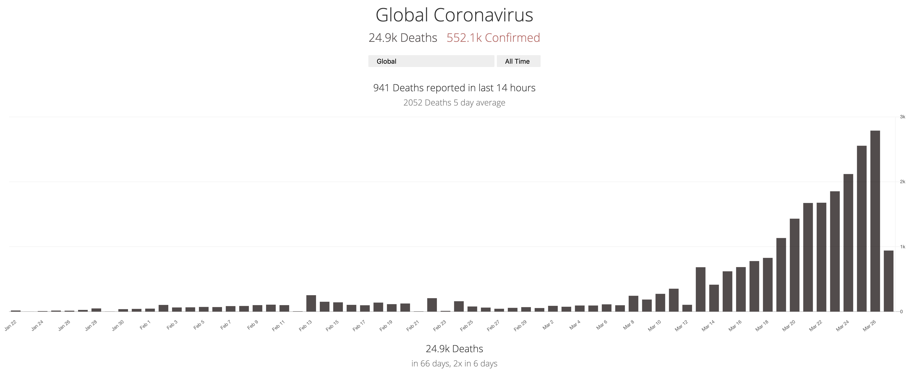
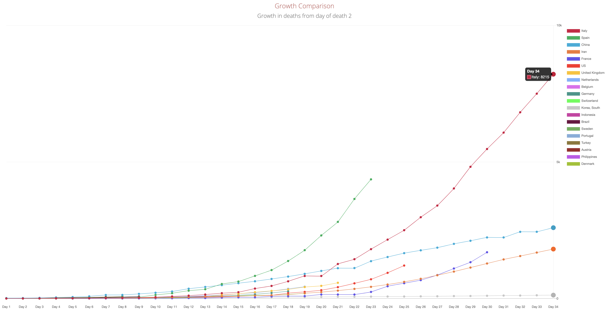

# Covid-19 (Novel Coronavirus) Global Charts

Website: <a href="https://coronavirus.projectpage.app">https://coronavirus.projectpage.app</a>

This project uses data from to product charts of deaths, confirmed cases and recovered cases from countries globally, based on data provided by JHU, the UK government, and the ECDC.

# View the data

You can see the data at https://coronavirus.projectpage.app

You can also access a json feed for any of the series at urls like this: https://coronavirus.projectpage.app/global.json

Data is held in memory on the server so response times should be fast even under load. This project and all code and data transformations are public domain and free in every sense, corrections and contributions are welcome. 

# Growth Comparison Chart
At the bottom of the first page is a chart comparing global rates of death, inspired by work by John Burn-Murdoch at the [Financial Times](https://www.ft.com/coronavirus-latest).

# Notes on Data
There are some inconsistencies in the source data, which where possible have been corrected. All changes made to the data are outlined below. 

## 2020-05-06

* Switched to sourcing UK deaths data from UK site
* UK testing data updated based on UK DHSC releases

## 2020-04-20

* Fix NY data for day 89
* UK and US testing data added
* Use preliminary UK data from UK gov

## 2020-04-16

* Fix Germany deaths for 2020-04-11
* Fix early US state data from JHU, updated later

## 2020-04-07

* Fix missing historical data - Wisconsin, Virginia, Montana
* Add lockdown dates 

## 2020-04-06

* Province comparisons

## 2020-03-27

* Investigating maintaining separate data files so that US states can be restored, and data can be updated by multiple people easily

## 2020-03-24

* Removed US overall data - a sum of all other series with country US
* Data source no longer provides recovered cases, so it was removed 
* Data source no longer provides US states, so it has been removed - investigating other options 
* UK does not have a full area breakdown at present

## 2020-03-22

* Added Global time series which is a sum of all other series 
* Added China overall data - a sum of all other series with country China
* Added Austrilia overall data - a sum of all other series with country Austrilia
* Added Canada overall data - a sum of all other series with country Canada

# Data Sources

* <a href="https://systems.jhu.edu/research/public-health/ncov/">John Hopkins University</a>
* <a href="https://www.ecdc.europa.eu/en/publications-data/download-todays-data-geographic-distribution-covid-19-cases-worldwide">ECDC</a>
* <a href="https://coronavirus.data.gov.uk/#countries">UK Department of Health and Social Care</a>

# Installation 

There are no external requirements except a working go install to build, data is read from CSV files and stored in memory. The server can be compiled and run locally with: 

COVID=dev go run main.go 

Today's data is updated hourly from the data source, historical time series data is updated once a day (for corrections). 

# License 

This code and any modified data is released as open source in the public domain, use it as you see fit. 

The author hereby disclaims any and all representations and warranties with respect to the code and website, including accuracy, fitness for use, and merchantability. Reliance on the website for medical guidance or use of the website in commerce is strictly prohibited.
